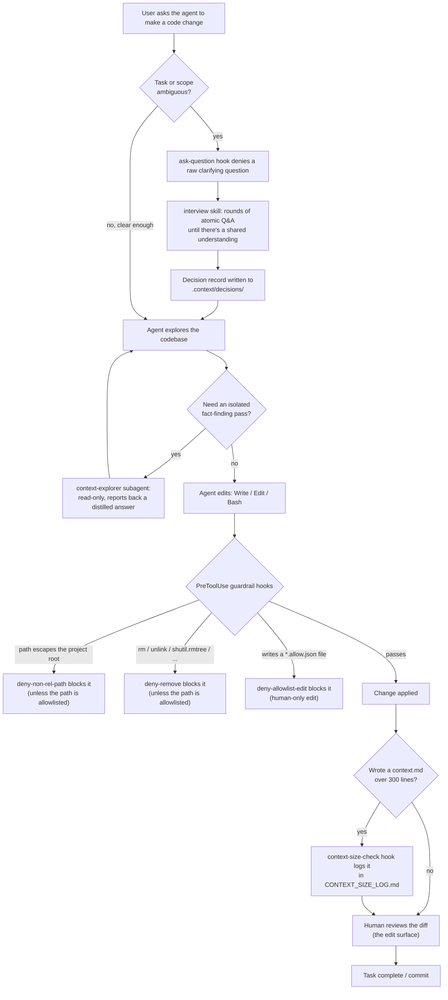

# rig
AI overhead system — a shared collection of agents, skills, hooks, and rules
for AI coding assistants (Claude Code, GitHub Copilot, Cursor, etc.), meant
to be pulled into other project repos.

## What installing rig changes

rig doesn't run anything itself — it's an augmentation layer. Once installed,
it's the target project's own coding agent that picks up the extra agents,
skills, and hooks and runs the loop below on an ordinary request like "make
this code change." The guardrail hooks and the `interview`/`context-explorer`
detour are what rig actually adds on top of a stock agent; everything else is
the agent doing what it would do anyway.



The guardrail hooks (`deny-remove`, `deny-non-rel-path`, `deny-allowlist-edit`,
`context-size-check`) are wired live only for the `claude` install target
today — they merge into `.claude/settings.json` at install time. The
`github-copilot` target currently receives the same agent/skill files but
without equivalent hook enforcement.

## Install into a project

From inside the target project (requires Node.js >= 16.7):

```bash
npx github:<you>/rig
```

Or if you've cloned this repo locally:

```bash
node /path/to/rig/install.js --target-dir=/path/to/project
```

This creates the appropriate dot-folder(s) in the project root (e.g.
`.claude/`, `.github/`) and copies the matching asset categories
(`agents/`, `skills/`, `hooks/`, `rules/`) into the layout each platform
expects, as defined in [`manifest.json`](./manifest.json).

By default, files that already exist at the destination are left alone
(so local edits survive a re-run). Pass `--force` to overwrite them.

### Options

| Flag | Description |
|---|---|
| `--targets=claude,cursor` | Only install for these platforms (default: all in `manifest.json`) |
| `--only=agents,skills` | Only copy these asset categories |
| `--target-dir=<path>` | Project root to install into (default: current directory) |
| `--force` | Overwrite existing files |
| `--dry-run` | Show what would happen without changing anything |

## Adding a new platform

Add an entry to `manifest.json` under `targets`: the dot-folder name and a
mapping from this repo's top-level asset directories to subpaths inside
that dot-folder.

## Adding assets

Drop new files into `agents/`, `skills/`, `hooks/`, or `rules/` at the repo
root. They'll be picked up automatically by any target whose manifest
mapping references that category.
