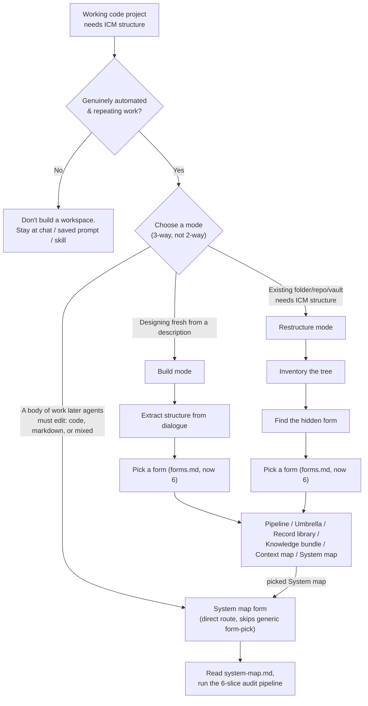

# ICM Architect — Flow Notes v2: New ICM Setup from a Working Code Project

Updated notes on the decision and construction flow the `icm-architect` skill uses when turning an **existing working code project** into an ICM structure. The skill has grown a sixth form — **System map** — purpose-built for "a body of work later agents must edit" (code, markdown, or mixed). For a working code project this is now the primary path, ahead of generic Restructure mode.

## Sources read

- [skills/icm-architect/SKILL.md](skills/icm-architect/SKILL.md) — mode selection (now 3-way), invariants, restructure steps, walk test (extended), guardrails
- [skills/icm-architect/references/core.md](skills/icm-architect/references/core.md) — unchanged: five design principles, five-layer hierarchy, stage contract format, naming, library rules, token discipline
- [skills/icm-architect/references/forms.md](skills/icm-architect/references/forms.md) — now **Six Forms**, adds System map
- [skills/icm-architect/references/system-map.md](skills/icm-architect/references/system-map.md) — **new file**: the System map audit pipeline in full
- [skills/icm-architect/assets/templates/object.md](skills/icm-architect/assets/templates/object.md) — **new template**: noun/object card
- [skills/icm-architect/assets/templates/process.md](skills/icm-architect/assets/templates/process.md) — **new template**: verb/process card
- [skills/icm-architect/assets/templates/CLAUDE.md](skills/icm-architect/assets/templates/CLAUDE.md), [.../CONTEXT.md](skills/icm-architect/assets/templates/CONTEXT.md), [.../stage-CONTEXT.md](skills/icm-architect/assets/templates/stage-CONTEXT.md) — unchanged entry/contract templates

## 1. Decision flow (mode + form selection)

**Citations:**
- Choose a mode is now three options, with System map called out directly: [SKILL.md L29-L33](skills/icm-architect/SKILL.md#L29-L33)
- Form table now lists six forms including System map: [SKILL.md L49-L56](skills/icm-architect/SKILL.md#L49-L56), full form definitions [references/forms.md L11-L18](skills/icm-architect/references/forms.md#L11-L18)
- System map form entry ("The sixth form... a folder someone will change: a repo, a markdown vault, or a mix"): [references/system-map.md L1-L3](skills/icm-architect/references/system-map.md#L1-L3)
- When to use it / when not to (code or markdown tree to audit vs. a repeating production line, org chart, or a model of thinking): [references/system-map.md L7-L11](skills/icm-architect/references/system-map.md#L7-L11)
- "Don't over-structure" guardrail (unchanged): [SKILL.md L101](skills/icm-architect/SKILL.md#L101)

## 2. Construction flow — System map audit pipeline (working code project → editable map)

This replaces the old generic Restructure walk as the concrete build sequence for a code project. It is **human-gated per slice** — stop after each one.

```mermaid
flowchart TD
    Where["Decide placement:<br/>map/ shelf beside developer-docs/, docs/,<br/>or vault root — NOT inside src/,<br/>NOT scattered through the mapped tree"] --> S0

    S0["Slice 0 — Inventory<br/>List tree; classify catalog/contract/factory/<br/>product/dead; infer nouns &amp; verbs;<br/>mark universe (live/leftover/ghost);<br/>propose tree + clusters."] --> G0{"HUMAN GATE:<br/>approval"}
    G0 -->|"no"| S0
    G0 -->|"yes"| S1

    S1["Slice 1 — Catalog<br/>Write map/CLAUDE.md, CONTEXT.md, schema,<br/>templates, objects/_index.md with stub lines.<br/>Wire one routing row from subject's<br/>existing entry file."] --> G1{"Walk: 'where do I go<br/>to understand X?' in 2 hops?"}
    G1 -->|"no"| S1
    G1 -->|"yes"| S2

    S2["Slice 2 — Nouns (objects)<br/>One card per type, from _templates/object.md.<br/>Cite path:line (code) or owning file (markdown).<br/>status: verified needs date + commit/branch<br/>+ citation. Fill Hits / Does not hit."] --> G2{"Re-verify claims<br/>against source"}
    G2 -->|"no"| S2
    G2 -->|"yes"| S3

    S3["Slice 3 — Verbs (processes)<br/>Only movements that actually run.<br/>One card per verb from _templates/process.md:<br/>Input → Movement → Output, numbered<br/>steps w/ citations, consumes/produces links."] --> S4

    S4["Slice 4 — Change-impact index<br/>effects/CONTEXT.md: 'if changing X,<br/>open these cards.' Catalog only —<br/>does not copy waterfalls."] --> S5

    S5["Slice 5 — Re-verify<br/>Rip load-bearing claims again,<br/>especially Hits / Does not hit."] --> WT["Validate with the<br/>System map walk test"]

    WT --> Done["Editable map ready:<br/>cold agent can answer 'what is X'<br/>and 'what else moves if I change X'"]
```

**Citations:**
- Placement rule (`map/` shelf beside existing orientation, propose before writing, not inside `src/`, not scattered): [references/system-map.md L27-L31](skills/icm-architect/references/system-map.md#L27-L31)
- Entry-file rule (edit `CLAUDE.md`; generate `AGENTS.md` + `routing.md` as byte-identical twins; never hand-edit twins): [references/system-map.md L31](skills/icm-architect/references/system-map.md#L31)
- Target tree shape (`map/CLAUDE.md`, `CONTEXT.md`, `_meta/schema.md`, `_templates/`, `objects/`, `processes/`, `effects/CONTEXT.md`): [references/system-map.md L33-L47](skills/icm-architect/references/system-map.md#L33-L47)
- Universe table (live / leftover / ghost): [references/system-map.md L19-L23](skills/icm-architect/references/system-map.md#L19-L23)
- Slice 0 Inventory: [references/system-map.md L55-L57](skills/icm-architect/references/system-map.md#L55-L57)
- Slice 1 Catalog: [references/system-map.md L59-L61](skills/icm-architect/references/system-map.md#L59-L61)
- Slice 2 Nouns/objects, source-of-truth rule, `status: verified` requirements, Hits/Does not hit: [references/system-map.md L63-L76](skills/icm-architect/references/system-map.md#L63-L76)
- Slice 3 Verbs/processes: [references/system-map.md L78-L82](skills/icm-architect/references/system-map.md#L78-L82)
- Slice 4 Change-impact index: [references/system-map.md L84-L86](skills/icm-architect/references/system-map.md#L84-L86)
- Slice 5 Re-verify: [references/system-map.md L88-L90](skills/icm-architect/references/system-map.md#L88-L90)
- Object card required sections (1. one sentence, 2. why this shape, 3. shape, 4. connected to, 5. if you change this, 6. surfaces, 7. see): [references/system-map.md L92-L100](skills/icm-architect/references/system-map.md#L92-L100), blank template at [assets/templates/object.md L1-L34](skills/icm-architect/assets/templates/object.md#L1-L34)
- Process card shape (Input → Movement → Output, Steps with citations, consumes/produces, Hits/Does not hit): blank template at [assets/templates/process.md L1-L26](skills/icm-architect/assets/templates/process.md#L1-L26)
- System map walk test (6 checks: map one hop away, colliding names explained without opening a card, card cites source + why + waterfall, effects index names hits, `See` link lands on source not another essay, token check): [references/system-map.md L102-L111](skills/icm-architect/references/system-map.md#L102-L111)
- Also folded into the general walk test as a 7th, form-specific bullet: [SKILL.md L95](skills/icm-architect/SKILL.md#L95)
- Failure modes (mapping aspiration as live, copying behaviour into cards, empty process/effects folders, two hand-edited entry files drifting, unverified `verified` cards, slurping `objects/` wholesale): [references/system-map.md L115-L120](skills/icm-architect/references/system-map.md#L115-L120)

## 3. Supporting concepts (mostly unchanged from v1)

| Concept | Where it's defined | Applied at |
|---|---|---|
| The ten invariants | [SKILL.md L14-L27](skills/icm-architect/SKILL.md#L14-L27) | Throughout |
| Five-layer context hierarchy | [references/core.md L19-L32](skills/icm-architect/references/core.md#L19-L32) | Slice 1 catalog, card writing |
| Naming conventions | [references/core.md L62-L69](skills/icm-architect/references/core.md#L62-L69) | Slice 1, card clustering |
| Library rules (one home per fact, generated indexes never hand-edited) | [references/core.md L71-L78](skills/icm-architect/references/core.md#L71-L78) | `objects/_index.md`, `effects/CONTEXT.md` |
| Token discipline (2k–8k tokens) | [references/core.md L80-L82](skills/icm-architect/references/core.md#L80-L82) | System map walk test token check |
| The six forms in depth | [references/forms.md L19-L172](skills/icm-architect/references/forms.md#L19-L172) | Form selection step |
| Guardrails | [SKILL.md L99-L103](skills/icm-architect/SKILL.md#L99-L103) | Before slice 0 and throughout |

## Key shift from v1

Previously, "working code project → ICM" ran through generic **Restructure mode** (inventory → find hidden form → classify 5 roles → propose → migrate → walk test), producing a Pipeline/Record-library/etc. shape out of the code. Now the skill routes a code project straight to the **System map form**, which does not reshape the codebase at all — it builds a parallel `map/` of object and process cards that *cite* the code (`path:line`) rather than migrating or restructuring it. See [ICM-compared.md](ICM-compared.md) for the full diff.
