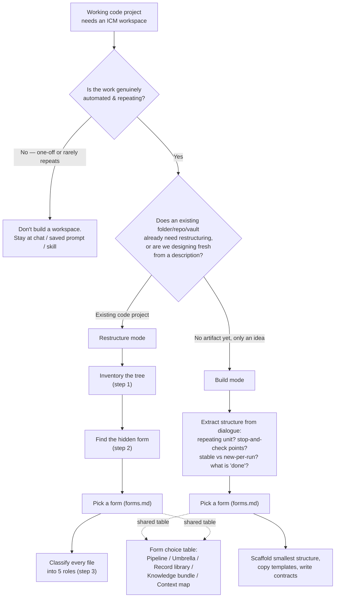
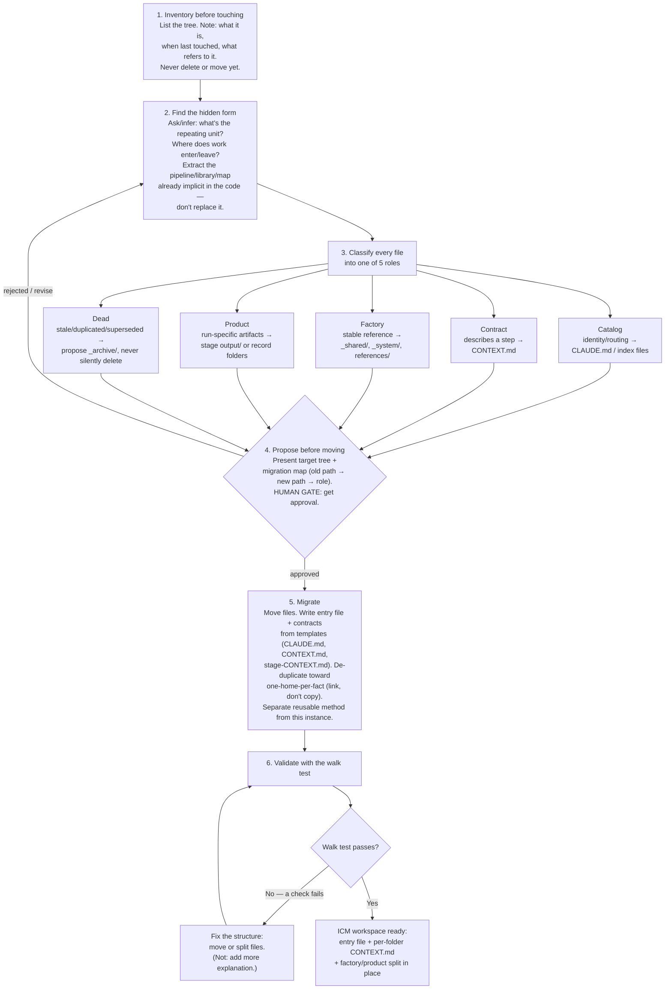

# ICM Architect — Flow Notes: New ICM Setup from a Working Code Project

Notes on the decision and construction flow the `icm-architect` skill uses when turning an **existing working code project** into an ICM workspace. This is the **Restructure mode** path (an existing folder/repo/vault that needs ICM structure), as opposed to **Build mode** (designing a workspace from a described process with no existing artifact).

## Sources read

- [skills/icm-architect/SKILL.md](skills/icm-architect/SKILL.md) — main skill instructions (mode selection, invariants, restructure steps, walk test, guardrails)
- [skills/icm-architect/references/core.md](skills/icm-architect/references/core.md) — five design principles, five-layer hierarchy, stage contract format, naming conventions, library rules, token discipline
- [skills/icm-architect/references/forms.md](skills/icm-architect/references/forms.md) — the five forms (Pipeline, Umbrella, Record library, Knowledge bundle, Context map)
- [skills/icm-architect/assets/templates/CLAUDE.md](skills/icm-architect/assets/templates/CLAUDE.md) — entry-file template
- [skills/icm-architect/assets/templates/CONTEXT.md](skills/icm-architect/assets/templates/CONTEXT.md) — root pipeline contract template
- [skills/icm-architect/assets/templates/stage-CONTEXT.md](skills/icm-architect/assets/templates/stage-CONTEXT.md) — stage-level contract template

## 1. Decision flow (mode + form selection)

**Citations:**
- Ladder / "don't over-structure" guardrail: [SKILL.md L98](skills/icm-architect/SKILL.md#L98)
- Mode choice ("Building from a described process" vs "An existing folder, repo, or vault that needs ICM structure"): [SKILL.md L29-L32](skills/icm-architect/SKILL.md#L29-L32)
- Build mode dialogue questions: [SKILL.md L36-L42](skills/icm-architect/SKILL.md#L36-L42)
- Form choice table (Pipeline/Umbrella/Record library/Knowledge bundle/Context map): [SKILL.md L46-L54](skills/icm-architect/SKILL.md#L46-L54), detailed in [references/forms.md L7-L17](skills/icm-architect/references/forms.md#L7-L17)
- Restructure mode step 1 (Inventory) and step 2 (Find the hidden form): [SKILL.md L64-L68](skills/icm-architect/SKILL.md#L64-L68)
- Step 3 (Classify every file): [SKILL.md L70](skills/icm-architect/SKILL.md#L70)

## 2. Construction flow — Restructure mode

This is the concrete build sequence once "working code project → ICM" has been chosen.

**Citations:**
- Step 1 Inventory: [SKILL.md L66](skills/icm-architect/SKILL.md#L66)
- Step 2 Find the hidden form: [SKILL.md L68](skills/icm-architect/SKILL.md#L68)
- Step 3 Classify every file + the 5 roles (Catalog/Contract/Factory/Product/Dead): [SKILL.md L70-L75](skills/icm-architect/SKILL.md#L70-L75)
- Step 4 Propose before moving (human gate on the migration map): [SKILL.md L77](skills/icm-architect/SKILL.md#L77)
- Step 5 Migrate (move, write entry file/contracts, de-duplicate, separate method from instance): [SKILL.md L79](skills/icm-architect/SKILL.md#L79)
- Step 6 Validate with the walk test: [SKILL.md L81](skills/icm-architect/SKILL.md#L81)
- The walk test itself (6 checks): [SKILL.md L83-L92](skills/icm-architect/SKILL.md#L83-L92)
- "If a step fails, fix the structure... by moving or splitting files": [SKILL.md L94](skills/icm-architect/SKILL.md#L94)
- Templates used at step 5:
  - Entry file shape (routing table, "where things live", "route by what just happened", one rule): [assets/templates/CLAUDE.md L1-L26](skills/icm-architect/assets/templates/CLAUDE.md#L1-L26)
  - Root pipeline contract shape (stage table, factory/product line, status-by-scanning rule): [assets/templates/CONTEXT.md L1-L12](skills/icm-architect/assets/templates/CONTEXT.md#L1-L12)
  - Stage contract shape (Inputs split working/reference, "Do NOT load", Process, Outputs, Human check): [assets/templates/stage-CONTEXT.md L1-L18](skills/icm-architect/assets/templates/stage-CONTEXT.md#L1-L18), full annotated example at [references/core.md L36-L59](skills/icm-architect/references/core.md#L36-L59)

## 3. Supporting concepts drawn on during construction

These aren't separate steps but are the rules the agent applies *while* doing steps 3 and 5 above.

| Concept | Where it's defined | Applied at |
|---|---|---|
| The ten invariants (one-folder-one-job, small entry file, numbering, explicit contracts, factory vs. product, edit surfaces, load-only-what's-needed, plain text, filesystem-as-state, instantiate-by-copying) | [SKILL.md L14-L27](skills/icm-architect/SKILL.md#L14-L27) | Checked throughout, esp. steps 3–6 |
| Five-layer context hierarchy (L0 entry → L1 root contract → L2 stage contract → L3 factory refs → L4 product/output) | [references/core.md L19-L32](skills/icm-architect/references/core.md#L19-L32) | Step 3 classification, step 5 writing contracts |
| Naming conventions (`NN_kebab-name` stages, underscore-prefixed system folders, one entry file per agent type) | [references/core.md L62-L69](skills/icm-architect/references/core.md#L62-L69) | Step 5 migrate |
| Library rules (catalog holds no books, one home per fact, generated indexes never hand-edited) | [references/core.md L71-L78](skills/icm-architect/references/core.md#L71-L78) | Step 5 de-duplication |
| Token discipline (2k–8k tokens per stage load) | [references/core.md L80-L82](skills/icm-architect/references/core.md#L80-L82) | Step 6 walk test |
| The five forms (Pipeline/Umbrella/Record library/Knowledge bundle/Context map) in depth | [references/forms.md L19-L143](skills/icm-architect/references/forms.md#L19-L143) | Step 2, form selection |
| Guardrails (don't over-structure, where ICM loses, anti-patterns) | [SKILL.md L98-L100](skills/icm-architect/SKILL.md#L98-L100) | Before step 1 and throughout |
