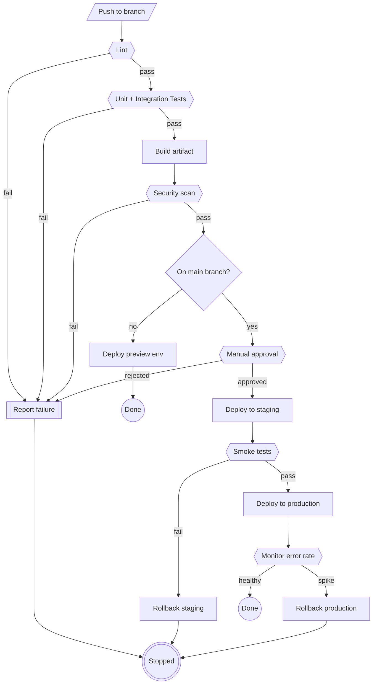

# CI/CD Pipeline Template

A flowchart for documenting a build/test/deploy pipeline, including gates
and rollback paths.

## Notes

- Use `{{Text}}` (hexagon) for gates/checks — lint, tests, scans, manual
  approval — so they visually stand apart from `[Text]` action steps.
- Use `{Text}` (rhombus) sparingly, only for a true binary branch
  (`Gate`) — keep hexagons for pass/fail checks that also have a failure
  exit.
- Route every failure path to a single terminal node (`Fail1` /
  `End3`) rather than dead-ending arrows — makes rollback/failure
  handling easy to audit at a glance.
- `[/Text/]` (parallelogram) marks the external trigger (a push, a
  webhook, a cron) that kicks off the pipeline.
- Swap `flowchart TD` for `flowchart LR` if the pipeline has more stages
  than fit comfortably top-to-bottom in a doc.
