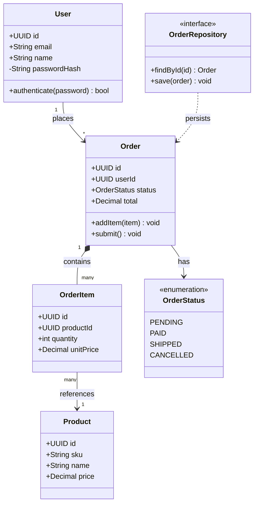

# Data Model / Class Diagram Template

A `classDiagram` for domain models, DTOs, and service interfaces —
useful for documenting an object model or a typed API contract.

## Relationship cheat sheet

| Syntax | Meaning |
|---|---|
| `A --> B` | association |
| `A --\|> B` | inheritance (A extends B) |
| `A ..\|> B` | realization (A implements interface B) |
| `A *-- B` | composition (B can't exist without A) |
| `A o-- B` | aggregation (B can exist without A) |
| `A ..> B` | dependency (A uses B) |

`+` public, `-` private, `#` protected, `~` package/internal.
`<<interface>>` / `<<enumeration>>` / `<<abstract>>` as stereotypes.

## Notes

- Good for capturing a domain model before writing types/interfaces, or
  for documenting an existing one during a review/handoff.
- Keep method signatures to the public contract — skip implementation
  details and private helpers that don't affect callers.
- For pure database schema (tables/FKs), prefer
  [database-erd.md](database-erd.md) instead — `classDiagram` is for
  behavior-bearing objects, not row storage.
