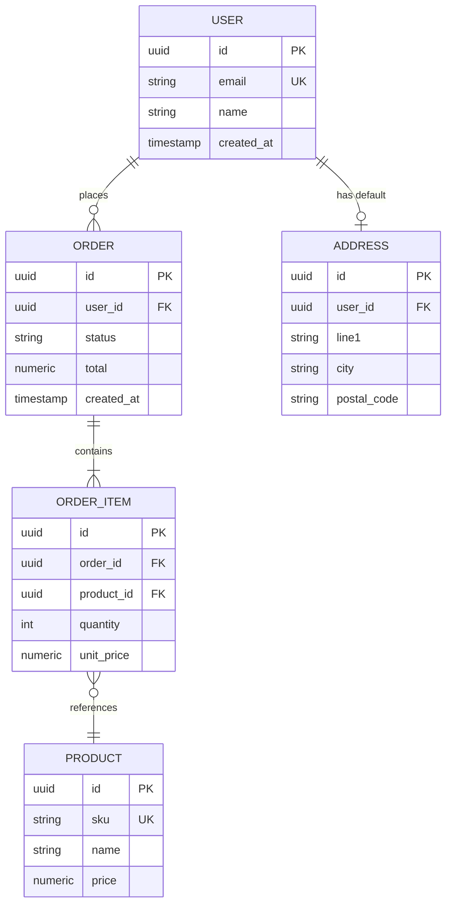

# Database ERD Template

An `erDiagram` for documenting relational schema: entities, attributes,
keys, and relationships.

## Relationship cardinality cheat sheet

| Left | Right | Meaning |
|---|---|---|
| `\|o` | `o\|` | zero or one |
| `\|\|` | `\|\|` | exactly one |
| `}o` | `o{` | zero or more |
| `}\|` | `\|{` | one or more |

Combine as `LEFT_ENTITY <left><right>--<right><left> RIGHT_ENTITY : verb`,
e.g. `USER ||--o{ ORDER : places` reads "one user places zero or more
orders."

## Notes

- Mark keys with `PK` (primary), `FK` (foreign), `UK` (unique) after the
  type in each attribute row.
- Label the relationship verb from the perspective of the left entity
  (`places`, `contains`, `references`) — makes the diagram read like a
  sentence.
- Keep attribute lists to what matters for the relationship being
  documented; this isn't a full migration/schema dump.
