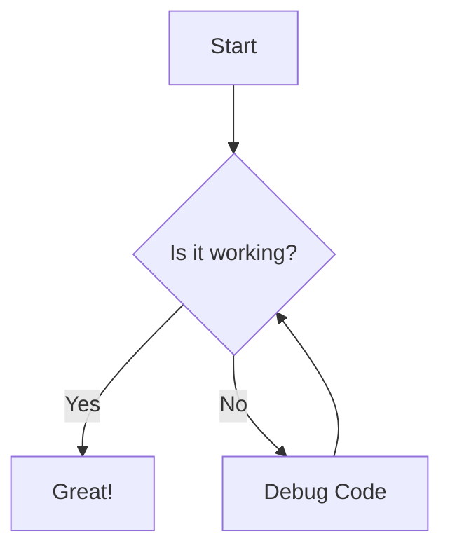
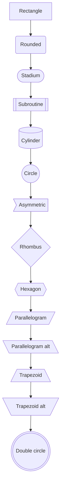
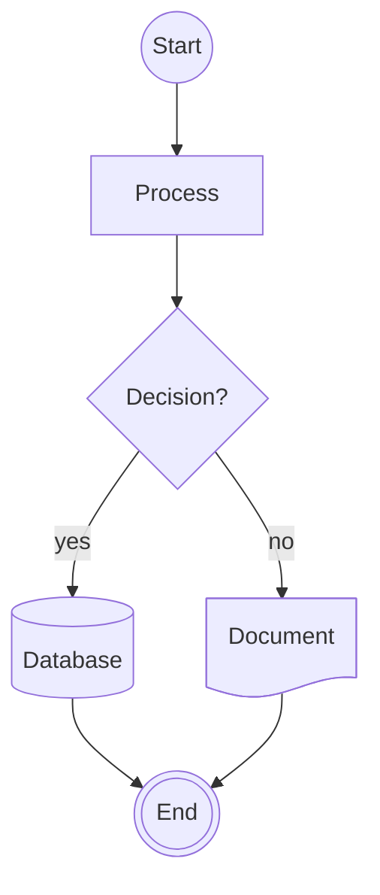

# Mermaid Flowchart Node Shapes

Reference of every node/block shape available in Mermaid flowcharts
(`graph`/`flowchart` diagrams). Source: [mermaid.ai flowchart syntax](https://mermaid.ai/open-source/syntax/flowchart.html).

# Flowchart TD



# Types

## Classic shapes

These work in any Mermaid version and are the ones you'll reach for 90% of
the time.

| Shape | Syntax | Typical use |
|---|---|---|
| Rectangle | `A[Text]` | default process/step |
| Rounded rectangle | `A(Text)` | soft process step |
| Stadium | `A([Text])` | start/end terminal |
| Subroutine | `A[[Text]]` | call to a predefined process/function |
| Cylinder | `A[(Text)]` | database |
| Circle | `A((Text))` | connector/small state |
| Asymmetric | `A>Text]` | flag/note |
| Rhombus (diamond) | `A{Text}` | decision/condition |
| Hexagon | `A{{Text}}` | preparation step |
| Parallelogram | `A[/Text/]` | input |
| Parallelogram (alt) | `A[\Text\]` | output |
| Trapezoid | `A[/Text\]` | manual operation |
| Trapezoid (alt) | `A[\Text/]` | manual operation (inverted) |
| Double circle | `A(((Text)))` | terminal/final state |



## Expanded shapes (v11.3.0+)

Newer Mermaid versions support an explicit `@{ shape: <keyword> }` syntax
with a much larger shape vocabulary, aimed at flowcharting/ANSI/ISO
standard symbols. Falls back to a rectangle if unsupported by the renderer.

```
A@{ shape: rect, label: "Text" }
```

| Keyword | Semantic name | Used for |
|---|---|---|
| `rect` | Process | standard process step |
| `rounded` | Event | rounded rectangle, an event |
| `stadium` | Terminal point | start/end pill |
| `diam` / `decision` | Decision | branch/condition |
| `hex` | Prepare/Condition | preparation, conditional setup |
| `circle` | Start | small start point |
| `sm-circ` | Small start | minor start point |
| `dbl-circ` | Stop | double-circle end point |
| `fr-circ` | Framed stop | framed circle end point |
| `cyl` | Database | cylinder/database |
| `h-cyl` | Direct access storage | horizontal cylinder |
| `lin-cyl` | Disk storage | lined cylinder |
| `doc` | Document | single document |
| `lin-doc` | Lined document | document with a line |
| `docs` | Multi-document | stacked documents |
| `tag-doc` | Tagged document | document with a tag |
| `tri` | Extract | extraction/triangle |
| `flip-tri` | Manual file | inverted triangle |
| `trap-t` | Manual operation | trapezoid, flat top |
| `trap-b` | Priority action | trapezoid, flat bottom |
| `sl-rect` | Manual input | slanted-top rectangle |
| `lean-r` | Data input/output | right-leaning parallelogram |
| `lean-l` | Data output/input | left-leaning parallelogram |
| `curv-trap` | Display | curved-side trapezoid |
| `div-rect` | Divided process | process split into sections |
| `lin-rect` | Lined/shaded process | process with a side line |
| `st-rect` | Multi-process | stacked processes |
| `fr-rect` | Subprocess | framed rectangle |
| `tag-rect` | Tagged process | rectangle with a tag |
| `notch-rect` | Card | notched-corner rectangle |
| `notch-pent` | Loop limit | notched pentagon |
| `bow-rect` | Stored data | bow-tie rectangle |
| `win-pane` | Internal storage | window-pane rectangle |
| `f-circ` | Junction | filled circle joining flows |
| `fork` | Fork/join | split or merge parallel flows |
| `hourglass` | Collate | hourglass shape |
| `bolt` | Communication link | lightning-bolt connector |
| `brace` | Comment (left) | left-facing brace annotation |
| `brace-r` | Comment (right) | right-facing brace annotation |
| `braces` | Comment (both) | two-sided brace annotation |
| `cross-circ` | Summary | crossed-circle |
| `flag` | Paper tape | flag/paper-tape shape |
| `bang` | Bang | emphasis/alert burst |
| `cloud` | Cloud | cloud service/storage |
| `folder` | Folder | directory |
| `browser` | Browser | browser window |
| `console` | Console | terminal/console window |
| `bucket` | Bucket | object storage bucket |
| `datastore` | Data store | DFD-style data store |
| `person` | Person | actor/user |
| `text` | Text block | plain label, no border |



## Icon and image shapes (v11.3.0+)

Requires an icon pack registered with `mermaid.registerIconPacks(...)`.

```
A@{ icon: "aws:lambda", form: "circle", label: "Handler", pos: "t", h: 48 }
B@{ img: "https://example.com/logo.png", label: "Service", w: 60, h: 60, constraint: "off" }
```

## Related templates

Practical, fullstack-flavored starting points that combine these shapes
live alongside this file:

- [system-architecture.md](system-architecture.md) — service/infra topology
- [request-sequence.md](request-sequence.md) — API request/response flows
- [database-erd.md](database-erd.md) — entity-relationship diagrams
- [data-model-class.md](data-model-class.md) — domain/class models
- [state-machine.md](state-machine.md) — lifecycle/status state diagrams
- [ci-cd-pipeline.md](ci-cd-pipeline.md) — build/deploy pipeline flowcharts
- [skill-behavior.md](skill-behavior.md) — AI skill/procedure decision flows
