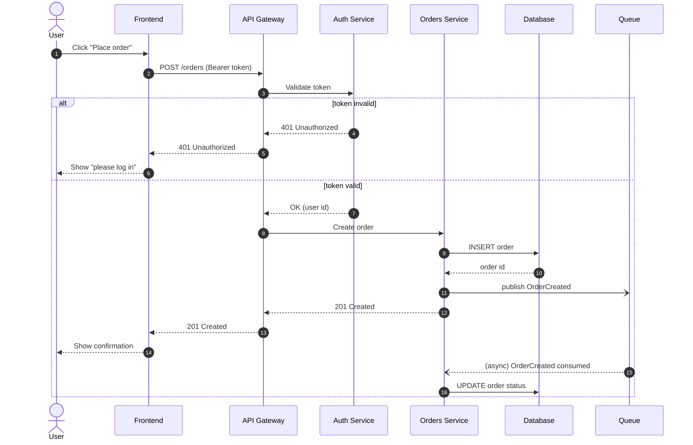

# Request Sequence Template

A `sequenceDiagram` for documenting an API request/response flow —
authentication, error paths, and async work included.

## Notes

- `->>` = request (solid, filled arrow), `-->>` = response (dashed).
- `-)` / `--)` = async/fire-and-forget messages (open arrowhead) — use for
  queue publishes and event consumption.
- `alt / else / end` for branching paths (success vs error); use `opt` for
  a single optional branch and `par / and / end` for parallel calls.
- `actor` renders a stick figure for humans; `participant` renders a box —
  reserve `actor` for the end user.
- `autonumber` is worth keeping on for anything you'll reference in code
  review comments ("see step 4").
