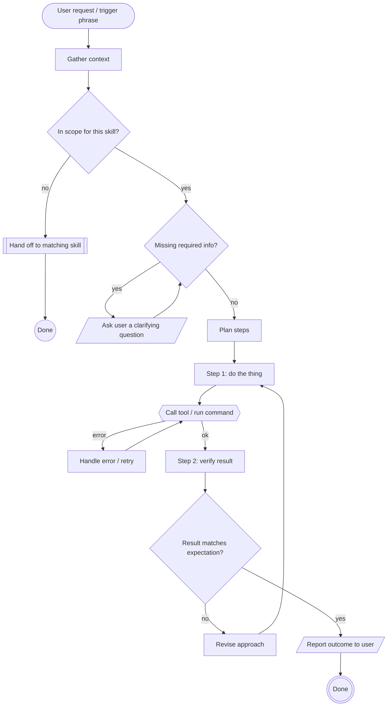

# Skill Behavior Template

A flowchart for documenting how an AI skill/procedure behaves: what
triggers it, what it decides, when it delegates to another skill or a
tool, and how it exits.

## Notes

- `([Text])` (stadium) marks entry/exit points — the trigger phrase and
  the terminal "done" states.
- `{{Text}}` (hexagon) marks a check with a real failure/retry path (tool
  calls, gated verification) — mirrors [ci-cd-pipeline.md](ci-cd-pipeline.md).
- `{Text}` (rhombus) marks a decision the skill itself makes (in scope?,
  missing info?, result matches?) — keep these to genuine branches, not
  every "if."
- `[[Text]]` (subroutine) marks delegation to another skill/procedure —
  use it instead of drawing that skill's internals inline.
- `[/Text/]` (parallelogram) marks user-facing I/O — asking a clarifying
  question, reporting the outcome — so it's visually distinct from
  internal processing steps.
- Loop failure/revise paths back to the nearest earlier step rather than
  to the top of the diagram — keeps retry scope honest (don't imply the
  whole skill reruns from scratch when only one step needs to).
- For multi-actor exchanges (skill calling out to another agent or
  service and waiting on a reply), use
  [request-sequence.md](request-sequence.md) instead — this template is
  for one skill's internal decision flow, not a conversation between
  parties.
