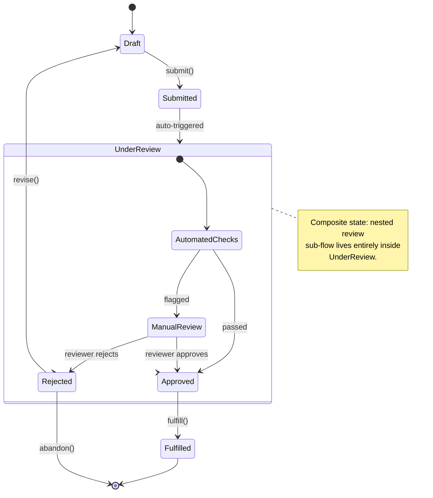

# State Machine Template

A `stateDiagram-v2` for lifecycle/status modeling — order status, auth
session state, job/task processing, feature flags, etc.

## Notes

- `[*] -->` is the initial state, `--> [*]` is a final state — every
  diagram should have both.
- Nest a sub-flow with `state Name { ... }` when a state has internal
  steps worth showing without flattening them into the top-level flow.
- Label transitions with the triggering event/method (`submit()`,
  `reviewer approves`) rather than a vague verb — makes the diagram
  double as a spec for what code needs to call what.
- Use `note right of X` / `note left of X` for constraints that don't fit
  as a transition (timeouts, side effects, invariants).
- For request/response flows between services, use
  [request-sequence.md](request-sequence.md) instead — state diagrams are
  for one entity's lifecycle, not multi-actor interaction.
