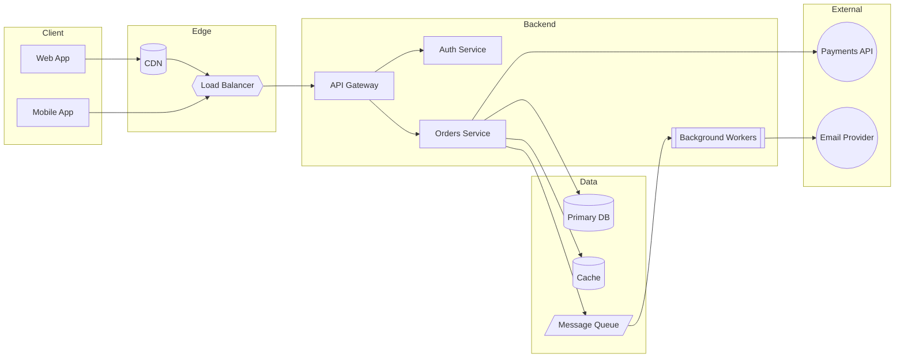

# System Architecture Template

A flowchart for laying out fullstack service topology: client, backend
services, data stores, and external integrations, grouped with subgraphs.

## Notes

- Group by layer/domain with `subgraph Name["Label"]`, not by team — keeps
  the diagram readable as services move between teams.
- Use `[(Text)]` (cylinder) for anything durable: databases, caches, CDN
  edge storage.
- Use `((Text))` (circle) for third-party/external systems you don't own.
- Use `[/Text/]` (parallelogram) for queues/streams — it reads as
  directional data flow.
- Keep arrows pointing the direction a request travels; use a second
  diagram (or dashed arrows `-.->`) if you need to show async/return paths
  without cluttering the main flow.
